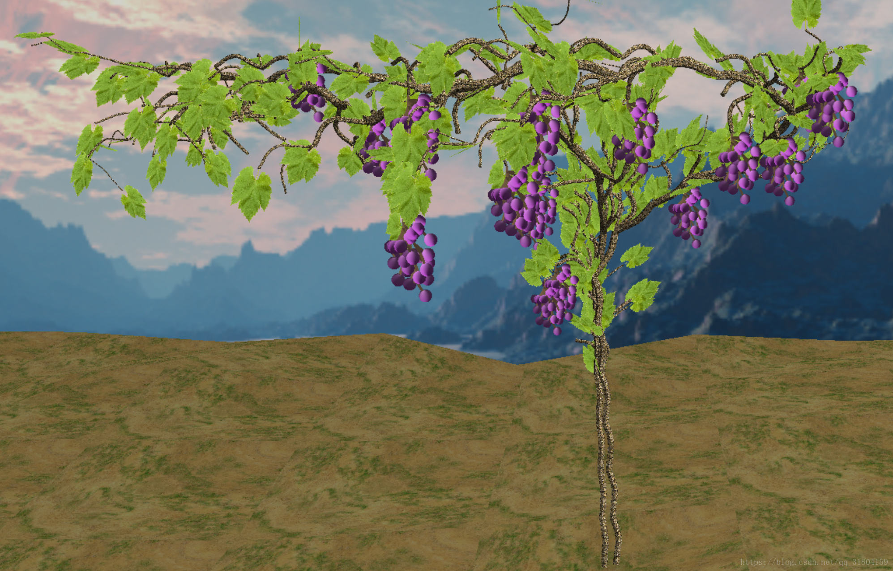
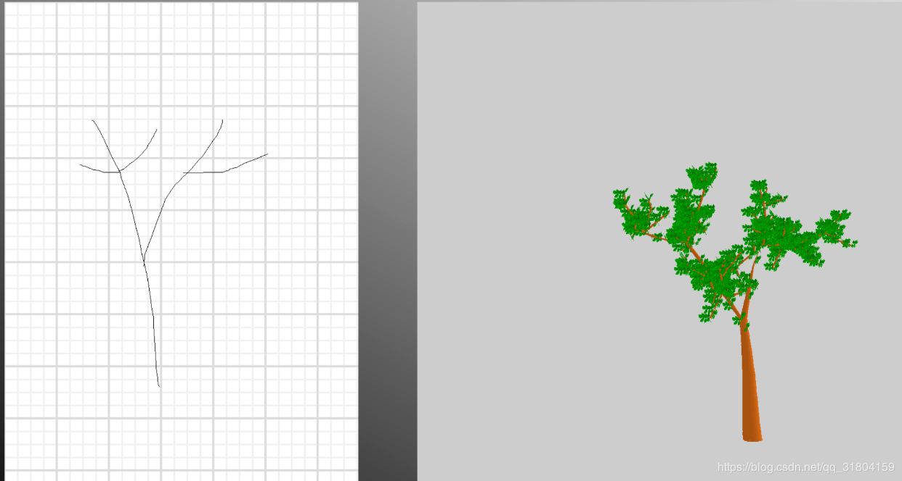
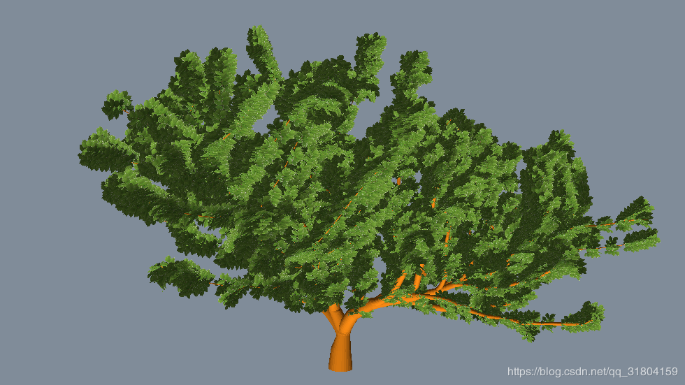
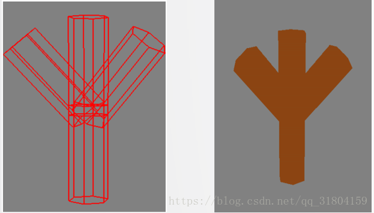
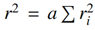
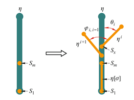

这是我csdn上的一个[博文](https://blog.csdn.net/qq_31804159/article/details/80498452)
# 几种建模方法概述
在游戏设计、电影和城市规划领域，3D树的建模在虚拟场景中占了很重要的角色。因此如何快速建立真实的三维树木模型一直是研究的热点问题。

关于树木建模存在很多经典的方法，典型的方法是利用<strong>L-system建模</strong>，使用参数化方法操作复杂的参数,这个方法擅长描述植物特性不同的物种，但是这种方法需要一定的专业知识而且只能控制局部特征，并不能控制整体的特征。另一方面，L系统与环境缺少交互作用，因为植物的生长是一件比较复杂的问题，需要环境的控制才能模拟出更为真实的植物模型。这就促使了开放式L系统的产生。开放式L系统：是对L系统扩展，以支持更丰富的环境相互作用。考虑的植物与环境的相互作用主要包含空间竞争、根系对营养和水分的竞争以及对阳光的竞争等。

当需要真实感还原现实世界中的树木时, 应用L系统的方法就不太适用. 因为对这些树木模型的参数及其对应的模型空间存在着一定的局限性。这时主要采用的方法是基于视频图像和点云的重建，将视频图像和点云的重建放在一起是因为，基于视频图像的方法其实就是根据图像序列先还原成一个树木的点云，然后再根据点云进行重建，而基于点云的重建则是直接根据设备获取了真实场景的点云数据。

基于视频图像或三维点云的方法主要局限于重建现实世界中的树木, 而基于草图的方法则允许用户在建模时能同时拥有较大的自由度以及创造力. 除此之外, 草图能让用户以一种比较直观的方式来表达其建模意图, 这正是前面所述的建模方式所欠缺的。

下面给出我尝试过的获得树木的骨架的几种方法：图一为分形树（使用L-system），图二为基于草图建树，图三为基于点云生成树。

<table align="center"><tr>
<td></td>
<td></td>
</tr>
<tr align=center>
<td >图一</td>
<td>图二</td>
</tr>

<tr>
	
</tr>
<tr>
	图三
</tr>

</table>

虽然有那么多种建树的方法，其实每个方法的核心都是<strong>提取树的骨架</strong>得到树的骨架的方法很多而且每种方法都不太相同，所以这里主要介绍通用的3D树的建模方法，对每种提取骨架的方法不进行细致讨论。

# 枝干表示

对于一棵树，枝干是其主要的组成部分，我们在计算机中表示一棵树的枝干是有很多方式的。

最为简单的方法：我们用一个圆柱或者一个多棱柱来模拟一节枝干，我们让这些圆柱紧密的连接就能产生一个光滑的枝条，这就是现在植物建模普遍使用的方法。

使用圆柱代替枝干也方便了帮树木模型贴上树皮。为了增加植物模型的视觉真实感，我们需要对枝干的宽度进行调整。
自然界中枝干和其子枝干是不一样粗的，所以我们要知道枝干和子枝干半径的对应关系。
对应关系如下:

其中a是一个系数，ri是子分支的半径，r是父分支的半径。

# 生成子枝干
果一种方法只能提取树的主枝干的骨架，如草图建树。那么我们要人工的给这个骨架生成多个分支骨架，从而才能得到整棵树的骨架。主要使用的方法是：利用<strong>植物的自相似性</strong>进行子枝干的生成，如下图：

这里定义枝干η = {Sγ; γ = 1, 2, .. . , k}

我们在η中选择一个点Sm，把从S1到Sm作为一个子枝干，通过旋转平移添加到η中，从而实现了分支的拓展。
# 树叶建模
 为了提升一棵树的真实感，合理的树叶是必然的。我们平时观察的树叶都是一个复杂的曲面，但是如果我们直接去对树叶建立一  个曲面（树的叶子可是繁多的），渲染如此多的树叶必然很影响效率的，而且叶子很小，效果也不见得有好，这性价比显然是很低的。 所以我们常用的方法是使用一种带alpha值的纹理图表示树叶。

