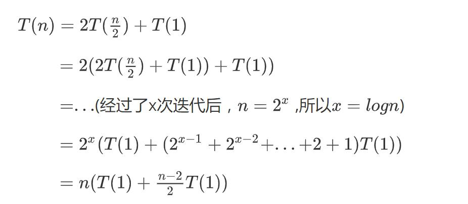

# Majority Element (Divide and Conquer)

*you can find this problem in LeetCode-169*

<h3> 
    Problem description


Given an array of size n, find the majority element. The majority element is the element that appears more than ⌊ n/2 ⌋ times.

You may assume that the array is non-empty and the majority element always exist in the array.

The range of length of array is n(1≤n≤5,000,000) and the element (integer) in array is no bigger than 10,000,00000.

这题的主要意思是从一个n个元素的数组中找到数目大于n/2的元素，

如输入n=7和数组

> 7
> 2 1 2 2 3 3 2

则输出

> 2

## 主要思路

这里主要采用了一个策略，因为从题目中可以得知，一定存在一个元素是majority Element，所以我们可以每次消去两个不同的数字，那么最后保留的一定是majority Element。


## 具体方法

每次将数组分成两个部分a和b，如果这两个部分中的保留的元素分别为Ea和Eb如果Ea和Eb相等那么返回Ea，如果Ea和Eb不相等则返回error（error表示消去这两个元素，这里我们可以用最大值表示error=10,000,00000），所以最后返回的一定是majority Element


## 代码（C++）

~~~c++
#include <iostream>
#include <cstdio>
using namespace std;
int error=1000000000;

int getMajorityElement(int *a,int b,int e)
{
    int mid =(b+e)/2;
    if(b>=e)
        return a[b];

```
int n1= getMajorityElement(a,b,mid);
int n2= getMajorityElement(a,mid+1,e);
if(n1 == error && n2 == error) return error;
if(n1 == error) return n2;
if(n2 == error) return n1;

if(n1 == n2)
    return n1;
else
    return error;
```

}

int main()
{
    int n;
    scanf("%d",&n);
    int *a = new int [n];
    for( int i =0; i< n; i++)
        scanf("%d",&a[i]);
    int num = getMajorityElement(a,0,n-1);
    printf("%d\n",num);

```
return 0;
```

}
~~~


## 时间复杂度分析

该算法的时间复杂度为**O(n​)**

分析递归函数 getMajorityElement所用时间规律：



(hexo不能渲染latex公式...，我也懒得配置了，就直接截图了)

所以该函数最终的时间复杂度为O(n)


 